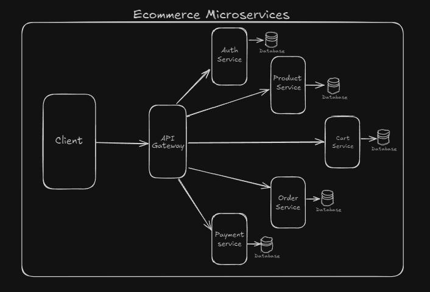

# Ecommerce Microservices

## What the heck are microservices?

Imagine running an eCommerce store like a well-organized mall. Instead of having one giant, overwhelmed **department store** trying to sell everything and keep track of it all (a monolithic approach), you’ve got **individual shops**—each handling their own piece of the puzzle.

There’s the **Auth Boutique**, where only trusted customers are allowed in. Next, the **Payments Emporium**, which handles all the money stuff—no haggling, just smooth transactions. Then, you’ve got the **Product Palace**, filled with shelves of all the awesome things for sale, and of course, the **Cart Corner**, where customers can stack up their items.

Each of these “shops” (aka microservices) runs independently. If the Cart Corner is having a sale, the Product Palace doesn’t need to freak out—it continues to do its job. And, if the Payments Emporium needs an upgrade, you can swap it out without shutting down the whole mall!

This is way better than a **monolithic** setup, where everything’s tangled together. In a monolithic system, if one part crashes (like the payment system), the whole store has to close. But with microservices, each service is its own boss, so even if one service has issues, the others keep on working.

By splitting everything into manageable, specialized services, you keep things running smoothly and efficiently. It’s like having a perfectly organized mall where each store does its own thing, but they all work together to create an amazing shopping experience!


## Architecture Overview




## Technologies Used

- **Node.js**: JavaScript runtime used to build the backend services.
- **Express**: Web framework for Node.js, used for building the API Gateway and each service's REST APIs.
- **MongoDB**: NoSQL database used for storing data across services such as users, products, and orders.
- **Redis**: In-memory data structure store, used for caching and improving performance.
- **Docker**: Containerization platform that simplifies the deployment and scaling of microservices.
- **Postman**: Tool used for testing the APIs and ensuring correct communication between the services.


## Installation

### Prerequisites

- [Docker](https://docs.docker.com/get-docker/): Make sure you have Docker and Docker Compose installed on your machine.
- Node.js (version 14.x or higher)
- NPM or Yarn (optional, for local development without Docker)

### Setting Up environment variables

Each service requires specific environment variables to work properly, for that you need to create a .env file in the following locations and fill it with mentioned environment variables.

1. API-Gateway

   1. PORT=5000
   2. NODE_ENV=dev **(or production)**

2. auth-Services

   1. PORT=5001
   2. SECRET=**Keep your jwt secret here**
   3. MONGO_URI=**Initate a cluster on MongoDB replace this with the URI**

3. product-Services

   1. PORT=5002
   2. MONGO_URI=**Initiate a cluster on MongoDB replace this with the URI**
   3. REDIS_PASSWORD=**Initiate a cluster on redis replace this with the password**

4. cart-Services

   1. PORT=5003
   2. MONGO_URI=**Start up a cluster on MongoDB replace this with the URI**

5. order-Services
   1. PORT=5004
   2. MONGO_URI=**Start up a cluster on MongoDB replace this with the URI**
6. payment-Services
   1. PORT=5005
   2. STRIPE_SECRET_KEY=**Create an account on stripe replace this with your secret key**

### Setting up docker and running the services

1. Clone the repository:

```
git clone https://github.com/Prakhar301101/Ecommerce_Microservices.git
cd ecommerce-microservices
```

2.  Ensure Docker is running on your machine.

3.  Build and start the containers using Docker Compose:

```
docker-compose up --build
```

This command will build all the services, create containers for them, and start them.

4.  Verify that the services are running:

After the build process, you should see the services running. Each service will be accessible at the following ports:

- **API Gateway**: [http://localhost:5000](http://localhost:5000)
- **Auth Service**: [http://localhost:5001](http://localhost:5001)
- **Product Service**: [http://localhost:5002](http://localhost:5002)
- **Cart Service**: [http://localhost:5003](http://localhost:5003)
- **Order Service**: [http://localhost:5004](http://localhost:5004)
- **Payment Service**: [http://localhost:5005](http://localhost:5005)

## Gateway and Services

#### API Gateway

The **API Gateway** is responsible for routing client requests to the correct microservice. It simplifies communication by exposing a unified interface to clients while hiding the complexity of the microservices behind it. It has a **Rate limiting** feature which sets a limit to the number of API calls to the gateway in a time interval which prevents any abuse of the API.

#### Services

**Auth Services**

Handles user authentication and authorization. It provides routes for login, registration, and token(JWT) management.

**Endpoints**
|HTTP Method|URL|Description|
|---|---|---|
|`POST`|http://localhost:5000/api/auth/register | Create new User |
|`POST`|http://localhost:5000/api/auth/login | Log-in User |
|`GET`|http://localhost:5000/api/auth/me | Get User details |
|`PATCH`|http://localhost:5000/api/users/me | Update User details |
|`POST`|http://localhost:5000/api/users/logout | Logout user |
|`GET`|http://localhost:5000/api/users/verify | Used for authorisation |

**Product-services**

Manages the catalog of products. It handles requests to view products, search for specific items, and manage product details (for admin users).
It also uses redis for caching product details for faster API response time.

**Endpoints**
|HTTP Method|URL|Description|
|---|---|---|
|`GET`|http://localhost:5000/api/product/view| Display all products or by queries |
|`GET`|http://localhost:5000/api/product/view/:id| Display selected product |
|`GET`|http://localhost:5000/api/product/categories | Display categories |
|`POST`|http://localhost:5000/api/product/addProduct | Add a product |
|`POST`|http://localhost:5000/api/product/addCategory | Add a category |
|`PATCH`|http://localhost:5000/api/product/update/:id | Update details of products |
|`DELETE`|http://localhost:5000/api/product/delete/:id | Delete products |

**Cart-services**

Manages the shopping cart functionality, allowing users to add, remove, and view products in their cart.

**Endpoints**
|HTTP Method|URL|Description|
|---|---|---|
|`GET`|http://localhost:5000/api/cart/| View the items in cart |
|`POST`|http://localhost:5000/api/cart/add| Add item to cart |
|`PATCH`|http://localhost:5000/api/cart/update | Update items in cart |
|`DELETE`|http://localhost:5000/api/cart/remove | Remove an item from cart |
|`DELETE`|http://localhost:5000/api/cart/clear | Clear the cart |

**Order-services**

Handles the creation of orders once a user completes their cart. It tracks the status of an order from creation to completion.

**Endpoints**
|HTTP Method|URL|Description|
|---|---|---|
|`POST`|http://localhost:5000/api/cart/| Place Order and initiate payment |
|`GET`|http://localhost:5000/api/cart/| Get Order details By orderID |
|`GET`|http://localhost:5000/api/cart/all | Get all orders for an user |
|`PATCH`|http://localhost:5000/api/cart/ | Update orderDetails |

**Payment-services**

Processes payments and interacts with payment providers (Stripe for our case). It confirms the transaction and links it to the order.

**Endpoints**
|HTTP Method|URL|Description|
|---|---|---|
|`POST`|http://localhost:5000/api/payment/check-out| Processes Payment through stripe and returns response |

